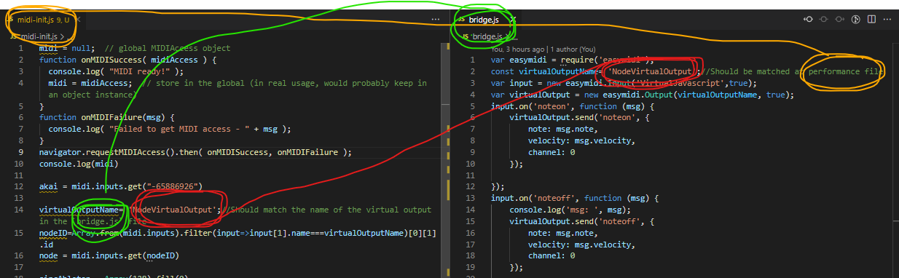

Trying out things with midi and [hydra](https://hydra.ojack.xyz/)... well, really, in `hydra` in `atom`, [atom-hydra](https://github.com/ojack/atom-hydra) package.

## Inspiration

### Diego Dorado

[Diego Dorados's gist](https://gist.github.com/diegodorado/dba8791968893b2d321b744b7fb07908)

# Usage with `ableton`

After installing dependency(ies) with ususal 

```
yarn
``` 
command, run

 ```
 node bridge.js
 ```

After running that command the virtual input device should be available on `ableton`. In this case the virtual input devices's name is `VirtualJavascript` (needles to say, you can change it). Set preferences so as to make communication possible (We don't really know if the three setings should be turned on)and also make/create a track that sends midi messages to that virtual device, as such:


An then listen in `atom-hydra` with the (usual) `navigator.requestMidiAccess` API. You need to match the virtual output device name as explained in the following section.

## device name matching

The `bridge.js` scripts recieves the midi messages sent from `ableton` and emits them to the software world through a virtual output device. Then the software that wants to listen to them (in our case `atom-hydra` ) must listen to that device. Upon listening (for example in the `midi-init.js` file) device names should (obviuosly) match, as such:



## Clarification
Although needles to say, it's said in order of/for clarity: "this is just one particular way of doing things".

A virtual device input is created which recieves midi data form `ableton` and another virtual device output sends it out so that `hydra` (or any other software) can listen to the messages. This was done in such a  way because we were not able to read direct midi messages from `ableton`.

[easymidi](https://github.com/dinchak/node-easymidi) provides such virtual devices creation. it'sthe only project dependency: couldn't get it to work on windows.
# Hardware devices controllers

Not just `ableton` can be used. Also midi hardware/devices/controllers may be used. This is done without using the virtual devices bridge thing that is used in the `ableton` case.

## Identify the midi `id` for your device

First gain acces to midi devices and store them in the `midi` global variable, and then execute the code in the `identify-midi.js` file in order to identify the hardware device's `id` in `hydra` in atom. Execute it in the developers console (`cmd+shift+I` in `atom`).

### akai mini mpk mkII case/example

After executing such code in the developers console, copy and paste it into the performance `midiinit.js` file which should be ran in `atom-hydra`


That was how that strange number got there:


That number is only valid for the `akai MPK Mini mkII`.

### korg nanoKONTROL2 case/example

Here is another image with an example of hardware/device/controller id identification with the `korg nanoKontrol2` device:


### The `ableton` case

In the `ableton` case this is done automatically and depends on the virtual device naming as explained in the section [above](#device-name-matching).

## `Hydra` usage

Again, needles to say, the way you use midi messages is up to you, but this is how it's done here:

After runnig the code in the `midi-init.js` file in `atom-hydra`, one can use the some globally scoped variables to control `hydra` synths/functions parameters/arguments: This variables are:

-  `sincAbleton`
-  `abletonNote`
-  `sincAkai`
-  `abletonVelocity`

In the `hydra-live.js` file there are examples of how to use them.

# References

- [ableton-js](https://github.com/leolabs/ableton-js)
- [using OSC & max 4 live](https://dev.to/fabiantjoeaon/sending-detailed-midi-messages-from-ableton-to-the-browser-using-osc-over-udp-4b9m)
- [eggman a.k.a john lindquist explaining how to send midi from `js` to `ableton`] (https://www.youtube.com/watch?v=vW2Lve_hMzg)
